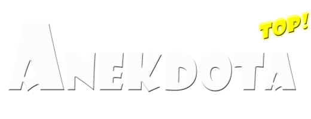

# Top Ανέκδοτα (Top Jokes) - B4A to KMP Migration

  
   
  

This repository contains the complete codebase of the classic Basic4Android (B4A) mobile application **Top Ανέκδοτα!** migrated to a modern, cross-platform **Kotlin Multiplatform (KMP) & Compose Multiplatform (CMP)** application targeting Android, iOS, Desktop (JVM), and Web (JS/WasmJS).

This was done for nostalgic and experimentation purposes only, the app is not going to be published by me in any store in the future.

Most of the functionality, excluding advertisements was migrated. If you liked or like the app please give this repo a star xD. Any bugs or feature requests might be addressed depending on the amount of my available free time (limited) or AI tokens...

---

This is a Kotlin Multiplatform project targeting Android, iOS, Web, Desktop (JVM).
* [/iosApp](./iosApp/iosApp) contains an iOS application. Even if you’re sharing your UI with Compose Multiplatform,
  you need this entry point for your iOS app. This is also where you should add SwiftUI code for your project.

* [/shared](./shared/src) is for code that will be shared across your Compose Multiplatform applications.
  It contains several subfolders:
  - [commonMain](./shared/src/commonMain/kotlin) is for code that’s common for all targets.
  - Other folders are for Kotlin code that will be compiled for only the platform indicated in the folder name.
    For example, if you want to use Apple’s CoreCrypto for the iOS part of your Kotlin app,
    the [iosMain](./shared/src/iosMain/kotlin) folder would be the right place for such calls.
    Similarly, if you want to edit the Desktop (JVM) specific part, the [jvmMain](./shared/src/jvmMain/kotlin)
    folder is the appropriate location.

### Running the apps

Use the run configurations provided by the run widget in your IDE's toolbar. You can also use these commands and options:

- Android app: `./gradlew :androidApp:assembleDebug`
- Desktop app:
  - Hot reload: `./gradlew :desktopApp:hotRun --auto`
  - Standard run: `./gradlew :desktopApp:run`
- Web app:
  - Wasm target (faster, modern browsers): `./gradlew :webApp:wasmJsBrowserDevelopmentRun`
  - JS target (slower, supports older browsers): `./gradlew :webApp:jsBrowserDevelopmentRun`
- iOS app: open the [/iosApp](./iosApp) directory in Xcode and run it from there.

### Running tests

Use the run button in your IDE's editor gutter, or run tests using Gradle tasks:

- Android tests: `./gradlew :shared:testAndroidHostTest`
- Desktop tests: `./gradlew :shared:jvmTest`
- Web tests:
  - Wasm target: `./gradlew :shared:wasmJsTest`
  - JS target: `./gradlew :shared:jsTest`
- iOS tests: `./gradlew :shared:iosSimulatorArm64Test`

---

Learn more about [Kotlin Multiplatform](https://www.jetbrains.com/help/kotlin-multiplatform-dev/get-started.html),
[Compose Multiplatform](https://github.com/JetBrains/compose-multiplatform/#compose-multiplatform),
[Kotlin/Wasm](https://kotl.in/wasm/)…

We would appreciate your feedback on Compose/Web and Kotlin/Wasm in the public Slack channel [#compose-web](https://slack-chats.kotlinlang.org/c/compose-web).
If you face any issues, please report them on [YouTrack](https://youtrack.jetbrains.com/newIssue?project=CMP).

---

### License

This project is licensed under the Apache License, Version 2.0. See the [LICENSE](LICENSE) file for details.